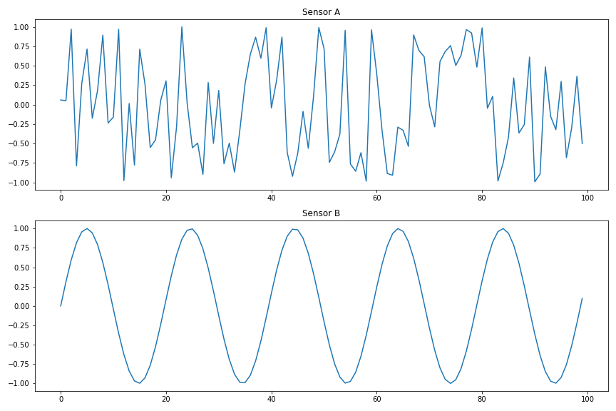
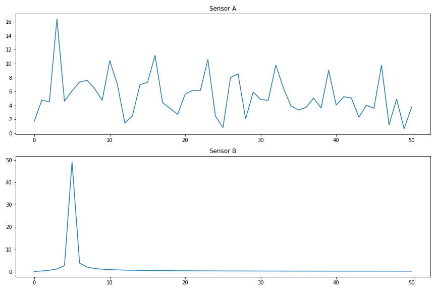
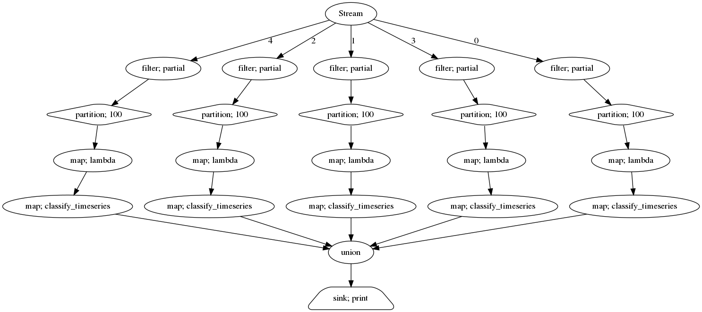

In this post, we will built a real-time feature extraction pipeline
for time series data.

## Introduction

As sensors get cheaper and smaller, the amount of data collected around us increases tremendously.
Finding good algorithms and techniques to dig through this flood of data is key here.
In this post, we will look into a very typical example: sensor data time series classification.
Think of predictive maintenance (you want to classify if the machine the sensor is monitoring will break soon), earthquake prediction (is this seismogram signal likely to come from a starting earthquake?) or Industry 4.0 applications (the sensor data can be used to decide, if the quality of the produced piece is good enough).

But how can you decide if for example a time series comes from a sensor on a broken machine or not?
Should you have a look on the specific time series values?
Take this data as an example:

| A | B |
|---|---|
|	0.721266  |	0.824133 |
|	0.720729  |	0.959994 |
|	-0.993967  |	0.999405 |
|	0.999160  |	0.938408 |
|	0.681660  |	0.783130 |
|	-0.551846  |	0.549173 |
|	0.852013  |	0.260040 |
|	-0.804603  |	-0.055218 |
|	0.708622  |	-0.364928 |
|	0.888114  |	-0.637975 |

What do you think, is A or B the broken one?
Looking at the graphs will make it already much easier for you:

[](../assets/images/stream_timeseries.png){:class="center-image"}

Clearly, B looks quite ok whereas A seems to be wrong.
Why was that easier?
Because your brain has extracted a *feature* of the time series:
series B looks much more regular than series A.
How can we put this into numbers for a computer to understand?
Let's have a look into the [fourier transformation](https://en.wikipedia.org/wiki/Fourier_transform) (FT) of the time series:


[](../assets/images/stream_timeseries_fft.png){:class="center-image"}


As sensor B only consists of a regular monofrequent sinus wave, it has a very simple FT graph whereas sensor A has many different frequencies.
So a good way to distinguish between the two might be:

```python
>>> (np.fft.rfft(broken_sensor)[5], np.fft.rfft(ok_sensor)[5])
(8.200073838092766, 49.31218607073689)
```

## Feature Extraction with tsfresh

Calculating a single number (or multiple of them) that represent a specific characteristics of the time series is called *feature extraction*.
For our example, we were able to come up with a good distinguishing example on our own, but how do you do this on more complicated examples?
Well, you can of course craft all of those features by hand, or you use automatic feature extraction libraries.

Our library [tsfresh](https://github.com/blue-yonder/tsfresh) is one of them.
It automatically extracts a bunch of features on all of your time series, that you can then feed into your training algorithm or use it for further processing.
It can also help you selecting only relevant features (but we will not cover that today).
Once you have your time series as `pandas.DataFrame` (or `dask` or `PySpark` dataframe), you can use `tsfresh` for the feature extraction:

```python
from tsfresh import extract_features

X = extract_features(df, column_id="id", column_value="value")
```

The `id` column lets you distinguish between different time series (in our case; sensor A and sensor B) and the `value` column tells tsfresh where to look for the time series values.
There are a lot more options to tune and tweak the extraction and if you are interested, have a look into the [documentation](https://tsfresh.readthedocs.io/en/latest/).

If you want to follow along, here is the full code to generate the two sensor data streams, chunk it up into packages of size 100 and prepare it for feature extration:

```python
import pandas as pd
import numpy as np
from itertools import islice

def generate_a():
    # The "broken" sensor
    while True:
        yield np.sin(np.random.randn())

def generate_b():
    # The "good" sensor
    counter = 0
    while True:
        yield np.sin(counter / np.pi)
        counter += 1

# Generate a fair amount of "continuous" data
df = pd.DataFrame({
    "A": islice(generate_a(), 50000),
    "B": islice(generate_b(), 50000)
})

# Stack the sensor data one after the other and chunk it up in packages of 100
from tsfresh.utilities.dataframe_functions import add_sub_time_series_index

df = df.melt()
df = add_sub_time_series_index(df, 100, column_id="variable")
```

Of course, also our previously discovered features is in the extracted features:

```python
>>> X["value__fft_coefficient__attr_\"abs\"__coeff_5"].loc[[(0, "A"), (0, "B")]]
0  A     1.459629
   B    49.312186
```

We won't go into detail on training a ML method using this data today.
Instead, we will use a very "stupid" (but effective) method to distinguish between good and broken sensor data

```python
def classify(X):
    return X["value__fft_coefficient__attr_\"abs\"__coeff_5"] < 40
```

but in principle you can put in every classification method you can think of here.

## Feature Extraction on real-time data

If we have a historic set of data, we can now extract features automatically and use them to either distinguish between broken and good sensors or train a ML method to help us with this task.
But how do you extract features in near-real time on a stream of sensor data?

Sure, you could just call `tsfresh.extract_features` repeatedly - but do you want to handle the partitioning into chunks of size 100 by yourself (which is a bit more complicated if you only get one message at a time)?
And the checkpointing in case your calculation fails?
And what if you want to consume a stream of data from, e.g., kafka, a typical streaming message broker system?

This is where [streamz](https://github.com/python-streamz/streamz) enters.
It is a very lightweight python library to help you build streaming applications.
Its basic mode of operations is to build up a computation graph of commands, you want to execute on a stream, first.
Later, when your events start to flow, `streamz` will call the prepared operations on each of the messages.
This declarative stream processing does not only improve the readability of the code, it also makes general implementations of things like checkpointing, windowing or multicore processing (`streamz` uses `dask` under the hood for this) very easy.

### Declaring the stream

Its best if you do the following in a jupyter notebook.
The basic building block of `streamz` is its `Stream` class.
We start by creating an instance of it:

```python
from streamz import Stream

source = Stream()
```

Every operation you perform on this stream will create a new instance of a `Stream` (or one of its many subclasses).
Every instance knows about its children, so it knows where to send the processed messages next, creating a full pipeline that also supports branching, loops and more complicated operations.
You should definitely check out the [documentation](https://streamz.readthedocs.io/) for more information.

In our example, we want to process the data of multiple sensors to decide, if they either come from a good or a broken machine.
Let's assume the messages from the sensors are in `json` format, and look like this:

```json
{
  "timestamp": "2020-08-14 17:18:31.446800",
  "value": 0.86974,
  "id": 4
}
```

So the first thing we want to do is branch the stream of messages into one for each sensor.
We do this using a filter:

```python
from functools import partial

def filter_out(x, id_value):
  """Returns true of the message is from the sensor with the given id"""
  return x["id"] == id_value

split_streams = [
  source.filter(partial(filter_out, id_value=id_value))
  for id_value in range(5)
]
```

`split_streams` is a list of streams (with length 5, because we will process 5 sensors in our example), where each stream only contains the messages for a single sensor. [^1]
Next, we partition the streams into chunks of size 100 to get a time series our of the single values.
Choosing 100 is a bit arbitrary in our toy example and this number would depend on the typical time scale of the data.

```python
partitioned_streams = [
  stream.partition(100).map(lambda x: pd.DataFrame(x))
  for stream in split_streams
]
```

The code partitions each stream independently and also turns the result (which is now a list of size 100 of jsons) into a pandas dataframe. [^2]
These streams of dataframe messages can now be used to actually do the classification, basically using the same method as in the batch case above:

```python
def classify_timeseries(df):
  """
  Extract features with tsfresh
  and use our defined classification method
  to stream out a json message, if the
  sensor data is broken or not.
  """
  X = extract_features(df, column_id="id", column_value="value",
                        column_sort="timestamp",
                        n_jobs=0, disable_progressbar=True)

  broken_sensor = classify(X)

  return {
      "broken": broken_sensor.iloc[0],
      "id": df["id"].iloc[0],
      "timestamp": df["timestamp"].iloc[0]
  }

classified_streams = [
    stream.map(classify_timeseries)
    for stream in partitioned_streams
]
```

In the end, we just need to collect all of the json messages for each sensor together, and we could e.g. stream them out to kafka or write them to a file.
In our case, we just write them out:

```python
result = Stream.union(*classified_streams)\
               .sink(print)
```

The full computation graph looks like this (and can be extracted from `streamz` using the `visualize` method):

[](../assets/images/streamz_graphviz.png){:class="center-image"}

So far, we have not processed any message but just built up the computation graph.
To trigger the pipeline, we need to send messages into the `source` stream.
To make it a bit more interesting for us, we start with 5 "good" sensor streams and after some time, we randomly choose one to "break".
We use the `emit` function to send messages into our prepared stream.

```python
import random
from datetime import datetime

def generate_stream():
  sensors = {
    0: generate_b(),
    1: generate_b(),
    2: generate_b(),
    3: generate_b(),
    4: generate_b()
  }

  broken_sensor = random.randint(0, 4)

  counter = 0
  while True:
    if counter == 300:
      # After 300 time steps, "break" a sensor
      sensors[broken_sensor] = generate_a()

    for sensor in sensors:
      value = next(sensors[sensor])

      source.emit({
        "timestamp": datetime.now(),
        "value": value,
        "id": sensor
      })

    counter += 1
```

Once you call the `generate_stream()` method, you will see messages popping up:

```python
{'broken': False, 'id': 0, 'timestamp': Timestamp('2020-08-14 17:18:31.446800')}
```

After some time, one of them will indicate that your sensor is broken:

```python
{'broken': True, 'id': 0, 'timestamp': Timestamp('2020-08-14 17:18:33.182423')}
```

Congratulations!
You have built a streaming application for time series classification based on automatic feature extraction.

There is a lot more to discover from here on: you can think of distributing your messaged via kafka (which would be more close to a real world application), you could scale the computation with `dask` (which is already built into `streamz`) or you could use more sophisticated methods for the classification.


[^1]: In case you are wondering why I used `functools.partial` and a function instead of just using a plain `lambda`, have a look into [this very interesting stackoverflow post](https://stackoverflow.com/questions/2295290/what-do-lambda-function-closures-capture).
[^2]: In principle we could have also done a windowing of size 100 instead of partitioning. The difference is, that when partitioning `[1, 2, 3, 4]` in size of 2, you only get `[1, 2]` and `[3, 4]` - whereas on windowing with size you get `[1, 2]`, `[2, 3]` and `[3, 4]`.
Which of them you want depends on your use-case.