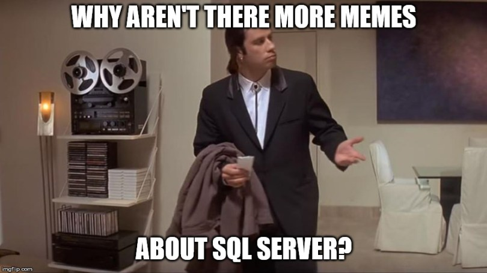
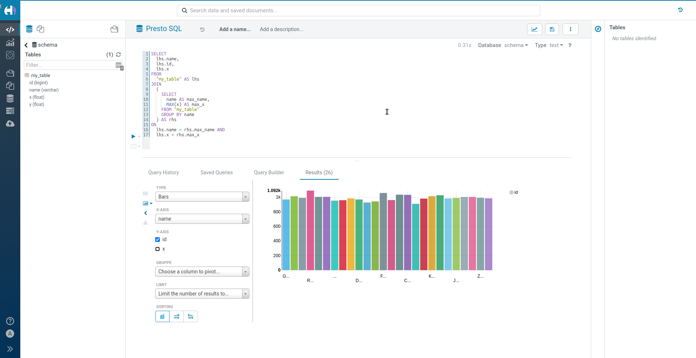

This post will describe what an SQL query engine is and how you can use `dask-sql` to
analyze your data quickly and easily and also call complex algorithms, such as machine learning, from SQL.

## SQL rules the world

If data is the new oil, SQL is its pipeline.
SQL used to be "only" the language for accessing traditional relational OLTP databases.
But today, it is much more: any BI-tool builds on SQL, for Data Analysts, Data Scientists and Data Engineer SQL is a base skill
and even NoSQL databases often implement a language quite similar to SQL to make adoption for its users simpler.

{:class="center-image"}
*Source: https://www.mlakartechtalk.com/sql-memes/*

In summary: whenever you are able to map your data pipeline and analysis on SQL, you open up your data for
a large range of applications and users.
The only question is: what to do if the data does not fit into the
constraints of a traditional relational SQL database (e.g. too much data, too many different formats)?

## SQL Query Engines

This is where SQL query engines come into play.
There job is, to make data from various data sources queryable
with SQL - even though the data are not stored in a (traditional) database at all.
Typical SQL query engines work as shown in this figure:

{:class="center-image"}

Let's quickly walk through the components:

1. When you issue a SQL query to the query engine (e.g. via a JDBC/ODBC connection in your BI-tool), the query gets first parsed and analyzed by the tool.
  The SQL query engine compares and enriches the query with metadata it has about the actual raw data.
  As there is no relational SQL database it can issue the query against, the SQL query is converted into API calls of one of the
  distributed computing frameworks, the SQL query engine speaks.
  Additional optimization steps can happen before and after this
  conversion.
  For example, Apache Hive submits MapReduce jobs whereas Apache Impala will create on-the-fly-compiled C++ programs.
2. The distributed computation framework is now responsible for performing the actual data analysis and distributing it over the cluster.
  These frameworks are the reason why SQL query engines work especially good with a lot of data: they can parallelize the work well and make use of the full power of your cluster.
  A typical well-known example for such a framework is Apache Spark.
3. The distributed computation framework needs hardware to perform the calculation. Different frameworks can work with different cluster types and resource schedulers, e.g. YARN, kubernetes, Apache Mesos, ...
4. Finally, the data to query lives on an external storage device, e.g. S3 or hdfs.
  This is very different from a traditional relational database,
  which contains both the data and the functionality to query it.

For the user, it really seems like querying a traditional relational database - even though it is not.

## Why so complicated?

This system of different components that need to play together nicely seems very complicated in comparison with a traditional relational database.
However, there are some crucial benefits which explains why SQL query engines are developed by and in use at so many small and large companies today.

* Using a distributed computation framework is a must to query data in the sizes we need to deal with today.
  However, distributed computation is hard.
  SQL query engines give us an easy to understand interface and hide all the difficult particularities of the systems.
* Separating data from computation allows to have multiple (automated) ways to ingest and analyze the data simultaneously.
 It can also reduce costs as computation and storage can be scaled independently.
* Reusing the same cluster for more complex, custom data pipelines and more simple SQL queries is again a way to reduce the overall costs.

As SQL is so widespread in use, SQL query engines democratize the access to the important data and algorithms and make them usable throughout the full company.

## What is missing?

Especially the more modern representatives of SQL query engines like Impala and presto are so widely in use for a good reason:
when it comes to stability and overall performance it is very hard to beat them.
However, there are some open issues that none of the presented solutions can easily handle so far:
* If your data is in CSV or parquet, none of the tools has a problem. But what if you have your data in a strange proprietary format you need a special library to read it?
* Machine learning is already playing a large role in many companies and is also making its way from the Data Scientists to the Analyst.
  Currently, the support for ML prediction or training within the SQL queries is only basic, and interacting with the modern well-known libraries such as tensorflow, keras or scikit-learn is mostly impossible.
* SQL query engines make it very simple and comfortable to query the data, but sometimes too simple.
  The world is messy, with inhomogeneous clusters, old historic batch systems, messy data and complicated transformation steps.
  Including these things into the rigid concept of the SQL query engines can be tedious if not impossible.

## dask and dask-sql

So, how can we do better?
With the power of Python and Dask!

{:class="center-image"}

Dask is a distributed computation framework written in Python and is comparable to Apache Spark (but is actually a lot more than that).
If you want, you can find more information on its [website](https://dask.org/).
`dask-sql` (disclosure: I am the author) adds an SQL query layer on top of Dask.
It uses [Apache Calcite](https://calcite.apache.org/) for query parsing and optimization and translates the SQL into a Dask computational graph, which is then executed on the cluster.
The SQL queries can either issued from within Python code and notebooks directly or via an SQL serve speaking the presto on-wire protocol (which allows to connect any BI tool or external application).

How does Dask (and `dask-sql`) solve some shortcomings of the other SQL query engines?
* Using python as the primary language opens up a wide variety of integrations and a vast ecosystem of tools and libraries.
  Every format and file you can read in with Python (which is basically everything) can also be used in Dask and `dask-sql`, not only limited to the typical big data formats such as parquet.
  (But of course, also those are [supported](https://docs.dask.org/en/latest/dataframe-create.html)).
* Dask is able to connect to a [large variety](https://docs.dask.org/en/latest/setup.html) of cluster types and systems, including YARN, k9s, Apache Mesos, various batch systems, cloud providers, HPC systems or manual deployments.
  You can even mix and match these, which makes it a lot more flexible than most of the other systems.
  Its large set of debugging and monitoring tools makes the process of finding performance bottlenecks easy.
* Python is the language of Data Science - so porting and reusing algorithms, implemented transformation steps and tools from your Data Science team is much easier.
  [User defined functions](https://dask-sql.readthedocs.io/en/latest/pages/custom.html) (UDFs) inside SQL queries come without any performance drawbacks in `dask-sql` and can range from simple numeric formulas to complex calls to machine learning libraries or other tools.
  They can be used when the SQL standard functions (a [large fraction](https://dask-sql.readthedocs.io/en/latest/pages/sql.html) is already implemented in `dask-sql`, but not everything) are not enough anymore.
  As dask dataframes mimic the well-known pandas API, it is also very simple to define complicated distributed transformations and use them from within SQL.
* Probably even more than any other framework (such as Apache Spark), the dask ecosystem contains connectors, integration and wrappers for so many things, ranging from machine learning, to external system support and special use-cases (such as geospatial data).
  Just a small glimpse [here](https://pypi.org/search/?q=dask).

{:class="center-image"}
*Data on S3 queried distributed from a BI tool (Apache Hue in this case) via `dask-sql` in the background*

There must be a problem, or? Well, there is. Dask itself is a very mature project with many years of experience and a large community.
`dask-sql` on the other hand is still a very young project and there are still a lot of possibilities to improve.
At least this is something, you can help with your feedback and contribution :-)

`dask-sql` is compatible with [blazingSQL](https://blazingsql.com/), a SQL query engine for computations on GPUs.
Using GPUs adds a huge performance boost and allows you to perform SQL analysis on large amounts of data in no time.
Adding custom functions is a more complicated, but the RAPIDS framework, which blazingSQL is using adds many possibilities - also for machine learning or graph analytics.

## Summary

SQL query engines are a crucial part in the data architecture: it opens up the data and computation power not only to the few Data Engineers and distributed system experts, but to a large group of users and applications.
Dask and `dask-sql` also port these benefits into the python world and the combination of distributed processing, Python and Dask give you even more benefits.

We have touched on a lot of different topics, and you might want to read more details on the specific parts:

* Information on `dask`: [dask.org](https://dask.org/)
* Information on `dask-sql`: [nils-braun.github.io/dask-sql](https://nils-braun.github.io/dask-sql/)
* SQL reference of `dask-sql`: [dask-sql.readthedocs.io/en/latest/pages/sql.html](https://dask-sql.readthedocs.io/en/latest/pages/sql.html)
* Deploying and connecting to a `dask` cluster: [docs.dask.org/en/latest/setup.html](https://docs.dask.org/en/latest/setup.html)
* `dask-sql` SQL server: [dask-sql.readthedocs.io/en/latest/pages/server.html](https://dask-sql.readthedocs.io/en/latest/pages/server.html)

This is the first part in a series of blog posts on `dask-sql`.
The next posts will go into detail on installation and usage of the library.